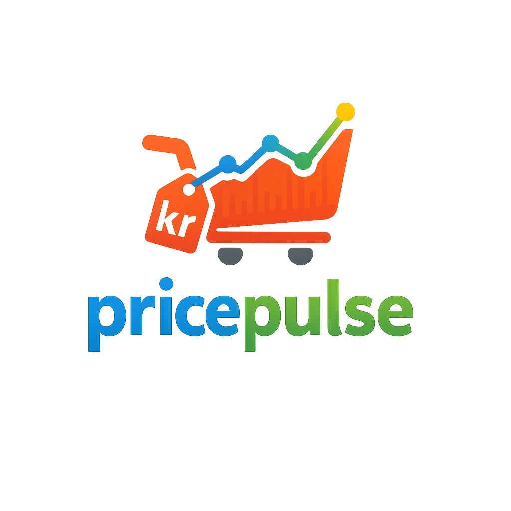
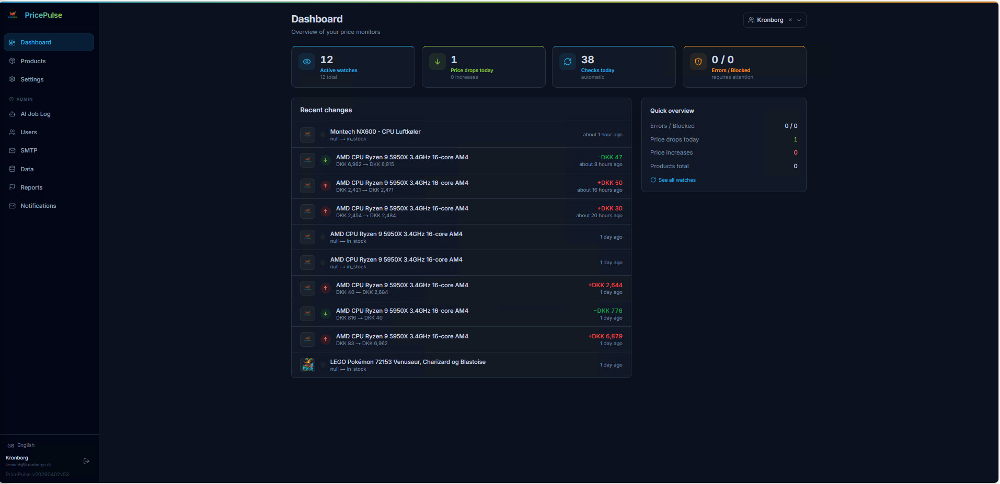
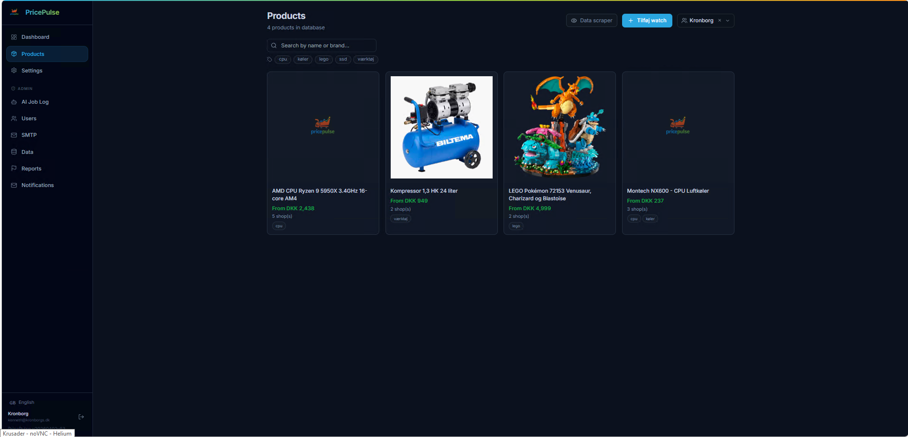
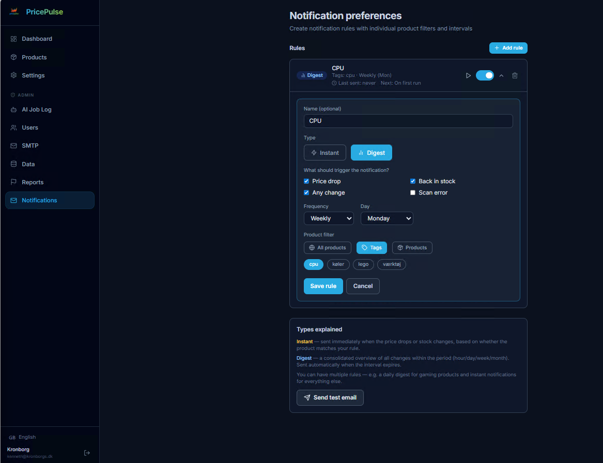
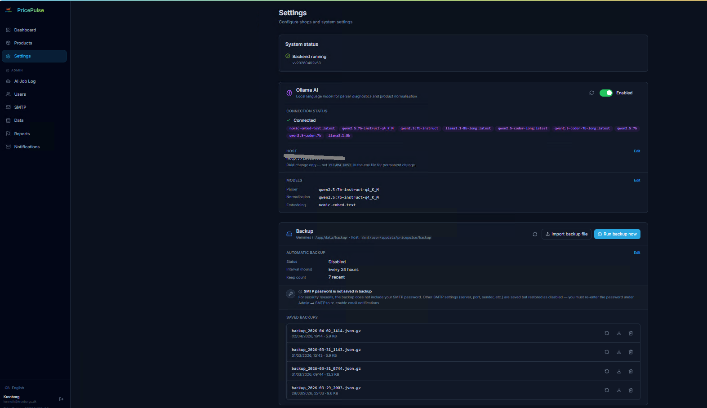
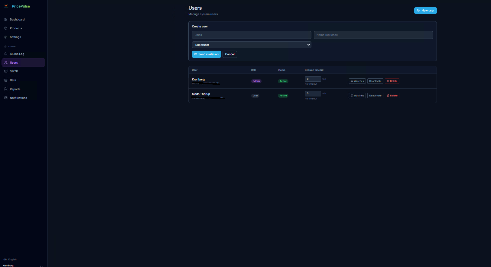

<div align="center">
  
  <h1>PricePulse</h1>
  <p><strong>Self-hosted prisovervågning til danske webshops</strong></p>
  <p>
    
    
    
    
    
  </p>
</div>

---

PricePulse holder øje med priser på tværs af danske webshops og sender dig besked, når prisen falder eller en vare kommer tilbage på lager. Alt kører lokalt i din egen infrastruktur  ingen cloud, ingen abonnement.

## Skærmbilleder

<!-- SCREENSHOT-GUIDE
     Alle billeder tages i browseren med PricePulse kørende (mørkt tema).
     Gem som PNG, helst 1400-1600px bred, i mappen assets/screenshots/.
-->

### Dashboard

> **Tag screenshot af:** Hele dashboard-siden — stats-rækken øverst (antal watches, aktive, fejl, prisfald i dag), seneste prisændringer i midten, og evt. fejl-banneret i bunden.

### Watches — oversigt

> **Tag screenshot af:** Watch-listen med statusfiltre øverst (Alle / Aktiv / Afventer / AI / Pause / Fejl / Blokeret), søgefelt, og et par rækker watches med statusbadges og priser i DKK. Data webscraper åbnes via Produkter-siden eller direkte på `/watches`.

### Watch — detalje & prisgraf

> **Tag screenshot af:** En enkelt watch åbnet — prisgrafen i toppen (AreaChart med gradient og IQR y-akse), kilde-listen nedenunder med butikslogoer og priser side om side, og "Rapportér fejl"-knappen.

### Produkter — oversigt med tags

> **Tag screenshot af:** Produktoversigten med søgefelt, tag-filter-pills under søgefeltet, et par produktkort med billede, bedste pris og tag-badges, og gerne duplikat-advarslen øverst. Bemærk knapperne **Data webscraper** og **Tilføj watch** øverst til højre på siden.

### Produkt — detalje med tag-editor

> **Tag screenshot af:** En enkelt produktside åbnet — produktnavn, tag-editoren med et par tags og input-feltet ("Tilføj tags…"), multi-kilde prisgrafen nedenunder, og "Sammenflet"-knappen.

### Produkt — multi-kilde prisgraf

> **Tag screenshot af:** Zoom ind på prisgrafen på en produktside — vis AreaChart med gradient-fyldt kurver for mindst to butikker, "Billigst nu"-banneret og toggle-knappen Custom/MUI X øverst til højre.

### Notifikationspræferencer

> **Tag screenshot af:** Siden `/me/preferences` — Hændelsesnotifikationer (Prisfald, Tilbage på lager, Enhver ændring, Fejl), Digest-e-mail med frekvens- og dagvælger, og “Send test-e-mail”-knappen.

### Indstillinger — Backup

> **Tag screenshot af:** Settings-siden åben på Backup-sektionen — vis automatisk backup-konfiguration, SMTP-info-noten, og backup-listen med en eller flere filer.

### Første opsætning

> **Tag screenshot af:** Setup-guiden (åbnes automatisk ved ny installation) — vis de to faner "Ny konto" og "Gendan backup".

### Admin — Brugere

> **Tag screenshot af:** Admin → Brugere — brugertabellen med rolle-badges (admin/superuser/user), status, session-timeout og Deaktiver/Slet-knapper. Gerne med mindst to brugere synlige.

### Admin — SMTP

> **Tag screenshot af:** Admin → SMTP-siden med konfigurationsformularen udfyldt. Vis at status står "Konfigureret".

### Admin — Scraper-rapporter

> **Tag screenshot af:** Admin → Rapporter — vis fanerne (Alle/Nye/Læst/Løst), et par rapportkort med statusbadge, bruger-navn, watch-link og action-knapper (Markér læst / Løst / Slet).

### Global SMTP-advarsel

> **Tag screenshot af:** En hvilken som helst side (f.eks. dashboard) hvor SMTP-banneret vises øverst — det amber-farvede banner med "SMTP ikke konfigureret" og knappen "Opsæt SMTP".

---

## Funktioner

| Område | Hvad det gør |
|--------|-------------|
| **Prisovervågning** | Følger en eller flere butikskilder pr. produkt og registrerer hvert prisfald og lagerændring |
| **Valutakonvertering** | Pris gemmes automatisk i DKK via Danmarks Nationalbanks daglige valutakurser. Valuta-hint (EUR, USD, SEK osv.) sættes pr. watch/source. Råpris og kurs vises på detaljesiden — fx `115,83 kr. / €15,50 · 1 EUR = 7,47 kr` |
| **Multi-kilde sammenligning** | Viser alle butikspriser på samme produkt side om side med interaktiv AreaChart pr. kilde (gradient-fyld, IQR y-akse, "Billigst nu"-banner) |
| **Chart-valg** | Vælg pr. produkt mellem **Custom** (Recharts AreaChart) og **MUI X** (officiel MUI-komponent) via toggle i UI |
| **Produktkatalog** | Samler watch-kilder under ét produkt og foreslår automatisk mulige dubletter |
| **Produkt-tags** | Brugere tilføjer egne tags (fx `lego`, `akvarie`, `cpu`) direkte på produkter — søg og filtrer produktlisten på tags |
| **Produktsammenfletning** | Alle brugere kan flette egne produkter (ikke kun admins) — samler alle butikskilder under ét produkt |
| **E-mail notifikationer** | Prisfald, lager, enhver ændring eller fejl — konfigurerbart pr. bruger med valg af frekvens (straks/daglig/ugentlig/månedlig) |
| **Digest-e-mail** | Periodisk oversigt over alle ændringer — daglig, ugentlig eller månedlig med valgfri dag |
| **AI-assistent (Ollama)** | Analyserer sider der fejler og foreslår CSS-selectors, Playwright-behov og bot-beskyttelse |
| **Automatisk backup** | Tidsplanlagt backup af hele databasen til disk — download, gendan eller importer til ny server |
| **Brugeradministration** | Fler-bruger support med roller (admin/superuser/bruger), invitation via e-mail, session-timeout |
| **Scraper-rapporter** | Brugere kan rapportere fejl på en kilde direkte fra UI — admin/superuser håndterer og løser rapporter |
| **Scraper-engine** | HTTP (httpx) og JavaScript-rendering (Playwright), pluggable parsers: CSS, JSON-LD, inline JSON |
| **Fejlklassificering** | Kategoriserer fejl: parser-mismatch, JS-render krævet, bot-beskyttelse, timeout, HTTP-fejl |

---

## Roller og rettigheder

PricePulse har tre brugerroller. Den første konto der oprettes ved opsætning er altid **admin**.

| Funktion | Bruger | Superuser | Admin |
|---|:---:|:---:|:---:|
| Dashboard, watches, produkter (egne) | ✅ | ✅ | ✅ |
| Se alle brugeres watches og produkter | ❌ | ✅ | ✅ |
| Opret og rediger watches/produkter | ✅ | ✅ | ✅ |
| Tilføj/rediger tags på egne produkter | ✅ | ✅ | ✅ |
| Flette egne produkter | ✅ | ✅ | ✅ |
| Indstil notifikationspræferencer | ✅ | ✅ | ✅ |
| **Admin: Brugeroversigt** | ❌ | ✅ | ✅ |
| Opret nye brugere (invitation) | ❌ | ✅ | ✅ |
| Slet brugere med rollen 'bruger' | ❌ | ✅ | ✅ |
| Slet brugere med rollen 'superuser' eller 'admin' | ❌ | ❌ | ✅ |
| **Admin: Scraper-rapporter** | ❌ | ✅ | ✅ |
| **Admin: AI Job Log** | ❌ | ✅ | ✅ |
| **Admin: SMTP-konfiguration** | ❌ | ❌ | ✅ |
| **Admin: Datahåndtering** (slet data, overtag ressourcer) | ❌ | ❌ | ✅ |
| **Indstillinger: Butikker** (aktivér/deaktivér, rediger) | ❌ (skrivebeskyttet) | ❌ (skrivebeskyttet) | ✅ |
| **Indstillinger: Backup** (start, download, gendan, konfigurér) | ❌ (skrivebeskyttet) | ❌ (skrivebeskyttet) | ✅ |
| **Indstillinger: Ollama** (AI-host, modeller) | ❌ (skrivebeskyttet) | ✅ | ✅ |

> **Første opsætning:** Opsætnings-wizarden opretter automatisk systemets første admin-konto. Efterfølgende brugere inviteres via Admin → Brugere og modtager et link til at oprette deres kodeord.

---

## Quick Start

```bash
git clone https://github.com/Kronborgs/pricepulse.git
cd pricepulse
cp .env.example .env
# Redigér .env  se sektionen Miljø-variabler nedenfor
docker compose up -d
```

- **Web UI:** `http://localhost:3000`
- **API docs:** `http://localhost:8000/docs`

Forste gang du abner UI'en guides du igennem opsætnings-wizarden, hvor du opretter din admin-konto (eller gendanner fra en eksisterende backup).

---

## Opsetning pa Unraid

PricePulse kører som en Docker Compose-stack pa Unraid via **Compose Manager** (Community Applications plugin).

### Forudsætninger

1. **Community Applications** installeret (søg i Apps -> "Community Applications")
2. **Compose Manager** installeret via Community Applications
3. Git installeret på Unraid (`Nerd Tools` plugin -> installer `git`)

---

### Trin-for-trin

#### 1. Klon projektet til Unraid

SSH ind på din Unraid-server og kør:

```bash
cd /mnt/user/appdata
git clone https://github.com/Kronborgs/pricepulse.git
cd pricepulse
```

#### 2. Opret din `.env`-fil

```bash
cp .env.example .env
nano .env
```

Minimum du **skal** ændre:

| Variabel | Eksempel | Beskrivelse |
|---|---|---|
| `SECRET_KEY` | `$(openssl rand -hex 32)` | Generes med kommandoen i parentes |
| `FERNET_KEY` | Se nedenfor | **Vigtigt:** bevar denne på tværs af deployments, ellers mistes krypterede SMTP-adgangskoder |
| `POSTGRES_PASSWORD` | `MitSterkePassword123` | Vælg selv |
| `DATABASE_URL` | Se nedenfor | Skal matche POSTGRES_PASSWORD |
| `NEXT_PUBLIC_API_URL` | `http://192.168.1.XX:8000` | Din Unraid-servers LAN-IP |
| `CORS_ORIGINS` | `http://192.168.1.XX:3000` | Samme IP, port 3000 |
| `TZ` | `Europe/Copenhagen` | Tidszone |

**Generér `FERNET_KEY` én gang og gem den:**
```bash
python3 -c "from cryptography.fernet import Fernet; print(Fernet.generate_key().decode())"
```
> Sæt den genererede nøgle i `.env` som `FERNET_KEY=...` og bevar den ved fremtidige opdateringer.
> Hvis nøglen ændres eller fjernes, kan gemte SMTP-adgangskoder **ikke** longer dekrypteres.

**DATABASE_URL skal matche dit password:**
```
DATABASE_URL=postgresql+asyncpg://pricepulse:MitSterkePassword123@db:5432/pricepulse
```

#### 3. Tilføj stacken i Compose Manager

1. Gå til **Unraid webUI -> Docker -> Compose Manager**
2. Klik **Add New Stack**
3. Navn: `pricepulse`
4. Compose file path: `/mnt/user/appdata/pricepulse/docker-compose.yml`
5. Env file path: `/mnt/user/appdata/pricepulse/.env`
6. Klik **Save**
7. Klik **Start** pa stacken

#### 4. Abn appen og gennemfor opsetningen

Gå til `http://DIN-UNRAID-IP:3000`  opsætnings-wizarden starter automatisk første gang. Opret din admin-konto eller gendan fra en eksisterende backup.

> Forste gang du installerer oprettes butikker (Komplett, Proshop, mfl.) automatisk af migrationen. Du behøver ikke køre `seed` manuelt.

#### 5. Porte

| Service | Port | Kan ændres via |
|---|---|---|
| Frontend (UI) | 3000 | `FRONTEND_PORT=XXXX` i `.env` |
| Backend (API) | 8000 | `BACKEND_PORT=XXXX` i `.env` |

---

### Unraid Community Applications  ikon

**Icon URL:**
```
https://raw.githubusercontent.com/Kronborgs/pricepulse/main/assets/icon.png
```

---

### Unraid Docker-templates (enkelt-container opsætning)

Foretrækker du at køre PricePulse som **individuelle Docker-containere** i stedet for Compose Manager, kan du bruge de færdige Unraid-templates fra mappen `unraid/`.

#### Metode 1 — Gem lokalt på Unraid (anbefalet)

SSH ind på din Unraid-server og kør:

```bash
mkdir -p /boot/config/plugins/dockerMan/templates-user
wget -O /boot/config/plugins/dockerMan/templates-user/pricepulse-backend.xml \
  https://raw.githubusercontent.com/Kronborgs/pricepulse/main/unraid/pricepulse-backend.xml
wget -O /boot/config/plugins/dockerMan/templates-user/pricepulse.xml \
  https://raw.githubusercontent.com/Kronborgs/pricepulse/main/unraid/pricepulse.xml
```

Herefter vises de under **Docker → Add Container** i Unraid-menuen.

#### Metode 2 — Manuelt

1. Download `unraid/pricepulse-backend.xml` og `unraid/pricepulse.xml` fra dette repo
2. Kopier begge filer til `/boot/config/plugins/dockerMan/templates-user/` på din Unraid-server (via SMB: `\\UNRAID\flash\config\plugins\dockerMan\templates-user\`)
3. Åbn **Docker → Add Container** — templatene dukker nu op under "User Templates"

#### Rækkefølge og vigtige variabler

Start **pricepulse-backend** først og vent til den er oppe, før du starter **pricepulse** (frontend).

| Container | Variabel | LAN (plain HTTP) | Cloudflare tunnel / HTTPS |
|---|---|---|---|
| `pricepulse-backend` | `CORS_ORIGINS` | `http://192.168.1.50:3000` | `https://prisen.ditdomæne.dk` |
| `pricepulse-backend` | `FRONTEND_URL` | `http://192.168.1.50:3000` | `https://prisen.ditdomæne.dk` |
| `pricepulse-backend` | `COOKIE_SECURE` | `false` | `true` |
| `pricepulse` | `NEXT_PUBLIC_API_URL` | `http://pricepulse-backend:8000` | `http://pricepulse-backend:8000` |

> `FRONTEND_URL` styrer hvilken URL der indsættes i e-mails (notifikationer, glemt kodeord, afmeld-links). Sæt den til den adresse **brugeren** åbner PricePulse med.

---


```bash
cd /mnt/user/appdata/pricepulse
git pull
docker compose pull
docker compose up -d
```

Eller i **Compose Manager**: klik **Pull** og derefter **Restart**.

---

## Releases og versionering

Versioner følger formatet **`v[YYYYMMDD]v[N]`**  dato + build-nummer samme dag:

| Tag | Hvornaar |
|---|---|
| `v20260320v1` | Første release den 20. marts 2026 |
| `v20260320v2` | Anden ændring samme dag |
| `v20260321v1` | Første release næste dag |

```bash
# Tag og publicér en ny version
git tag v20260329v1
git push origin v20260329v1
```

GitHub Actions bygger og pusher automatisk til `ghcr.io/kronborgs/pricepulse-backend:latest` og `ghcr.io/kronborgs/pricepulse-frontend:latest`.

---

## Valutakonvertering

Priser gemmes altid i **DKK** i databasen. Når en kilde er på et udenlandsk site (f.eks. Amazon .de/.com), håndteres konverteringen automatisk:

1. **Auto-detect** — parseren prøver selv at aflæse valutasymbolet fra siden (€, $, £, SEK osv.)
2. **Valuta-hint** — du kan manuelt angive valuta (EUR, USD, GBP, SEK, NOK, CHF, PLN) ved oprettelse af watch/source
3. **Nationalbanken-kurser** — konverteringskurser hentes dagligt fra Danmarks Nationalbank og caches i 24 timer
4. **Råpris bevares** — den originale pris i kildevalutaen gemmes i `current_price_raw` / `last_price_raw` og vises på detaljesiden:

```
115,83 kr.
€15,50 · 1 EUR = 7,47 kr
```

> Konverteringen sker i `price_service.py` (v1 watches) og `source_service.py` (v2 sources). Eksisterende watches konverteres korrekt ved næste scrape-kørsel.

---

## Navigation

Navigationsmenuen er organiseret således:

| Menupunkt | Indhold |
|---|---|
| **Dashboard** | Oversigt over aktive watches, seneste prisændringer og fejl |
| **Produkter** | Produktkatalog med alle overvågede produkter |
| ↳ Knapper på Produkter-siden | **Data webscraper** (åbner watch-listen) og **Tilføj watch** direkte fra Produkter |
| **Indstillinger** | Butikker, Ollama AI, Backup, SMTP (roleafhængigt) |
| **Admin** | AI Job Log, Brugere, SMTP, Data, Rapporter (kun admin/superuser) |

> Data webscraper (`/watches`) åbnes via knappen på Produkter-siden. Watch-listen viser alle overvågede URL'er med priser, status og seneste tjektidspunkt.

---

## E-mail notifikationer (SMTP)

SMTP konfigureres under **Admin -> SMTP** i web-UI'en. Hvis SMTP ikke er sat op, vises en advarsel overst pa alle sider (kun synlig for admins).

> **Bemærk:** SMTP-kodeordet gemmes **ikke** i backup af sikkerhedsmæssige årsager. Øvrige SMTP-indstillinger gendannes ved restore, men som deaktiverede  genindtast kodeordet under Admin -> SMTP for at aktivere notifikationer igen.

---

## Backup & restore

Backups gemmes automatisk (eller manuelt) under **Indstillinger -> Backup**.

- Filer gemmes i `/app/data/backup` (Unraid: `/mnt/user/appdata/pricepulse/backup`)
- Download backup-filen lokalt som `.json.gz`
- Gendan direkte fra listen, eller upload en fil fra en anden installation
- Ved **Ny installation**: Opsætnings-wizarden tilbyder "Gendan backup" som alternativ til at oprette en ny konto

---

## Stack

| Lag | Teknologi |
|-----|-----------|
| Backend | Python 3.12, FastAPI, SQLAlchemy 2 (async) |
| Frontend | Next.js 14, TypeScript, Tailwind CSS, shadcn/ui |
| Database | PostgreSQL 16 |
| Cache/Queue | Redis 7 |
| Scraping | httpx + Playwright |
| AI (valgfrit) | Ollama (lokal LLM til parser-analyse) |
| Charts | Recharts |
| Scheduling | APScheduler |

---

## Fejlfinding

```bash
# Se alle container-logs
docker compose logs -f

# Kun backend
docker logs pricepulse-backend -f

# Kun frontend
docker logs pricepulse-frontend -f

# Database shell
docker exec -it pricepulse-db psql -U pricepulse
```

---

## Miljø-variabler

Se [.env.example](.env.example) for komplet liste.

---

## Licens

MIT